# insertfinity

An enhanced system compatible with Zack Freedman's Gridfinity system (<https://gridfinity.xyz/>).

Gridfinity enhanced bin + custom insert + part= insertfinity

## Table of contents

- [insertfinity](#insertfinity)
  - [Table of contents](#table-of-contents)
  - [STL list](#stl-list)
    - [Stackable bin](#stackable-bin)
    - [Stackable bin with label space](#stackable-bin-with-label-space)
    - [Stackable bin with open side](#stackable-bin-with-open-side)
    - [Insert](#insert)
    - [Exploded view](#exploded-view)
  - [Todo](#todo)

## STL list

### Stackable bin

| Link | Description | Dimension [mm] |
| ------ | ------------- | ---------------- |
| [1x1x2u](stl/bin-stacking-lip/1x1x2u+lip.STL) | Stackable bin 1x1x2u | 41.5x41.5x18.6 |
| [1x1x3u](stl/bin-stacking-lip/1x1x3u+lip.STL) | Stackable bin 1x1x3u | 41.5x41.5x25.6 |
| [1x1x4u](stl/bin-stacking-lip/1x1x4u+lip.STL) | Stackable bin 1x1x4u | 41.5x41.5x32.6 |
| [1x1x6u](stl/bin-stacking-lip/1x1x6u+lip.STL) | Stackable bin 1x1x6u | 41.5x41.5x46.6 |
| [1x1x8u](stl/bin-stacking-lip/1x1x8u+lip.STL) | 📍 Stackable bin 1x1x8u | 41.5x41.5x60.6 |
| [1x2x2u](stl/bin-stacking-lip/1x2x2u+lip.STL) | Stackable bin 1x2x2u | 41.5x41.5x18.6 |
| [2x2x2u](stl/bin-stacking-lip/2x2x2u+lip.STL) | Stackable bin 2x2x2u | 41.5x41.5x18.6 |

### Stackable bin with label space

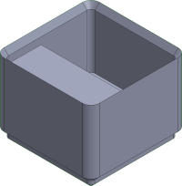

| Link | Description | Dimension [mm] |
| ------ | ------------- | ---------------- |
| [1x1x4u+lip&lbl](stl/bin-stacking-lip-labeled/1x1x4u+lip&lbl.STL) | Bin 1x1x4u with stacking lip & label | - |
| [1x1x8u+lip&lbl](stl/bin-stacking-lip-labeled/1x1x8u+lip&lbl.STL) | Bin 1x1x4u with stacking lip & label | - |

### Stackable bin with open side

| Link | Description | Dimension [mm] |
| ------ | ------------- | ---------------- |
| [1x1xo2u](stl/bin-open-stacking-lip/1x1xo2u+lip.STL) | Bin open 1 side 1x2x2u with stacking lip | 41.5x41.5x18.6 |

### Insert

| Image | Link | Description |
| ------- | ------ | ------------- |
| 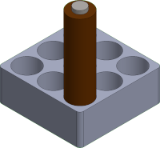 | [insert-aaa-battery](stl/insert/insert-aaa-battery.STL) | Store up to 9 AAA battery |
| 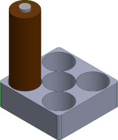 | [insert-aa-battery](stl/insert/insert-aa-battery.STL) | Store up to 5 AA battery |
| 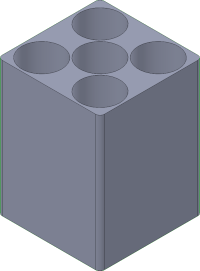 | [insert-5hole](stl/insert/insert-5hole.STL) | A simple pocket |
| 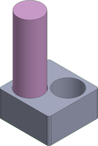 | [insert-18650-battery](stl/insert/insert-18650-battery.STL) | Store up to 2 18650 battery |
| 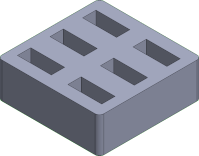 | [insert-usb-a](stl/insert/insert-usb-a.STL) | Store up to 6 usb type A |
| 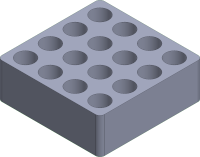 | [insert-tool-6mm](stl/insert/insert-tool-6mm.STL) | Store up to 12 tool ⌀6mm |
| 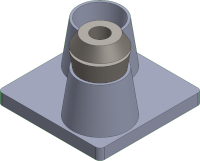 | [insert-er16-collet](stl/insert/insert-er16-collet.STL) | Store up to 2 er16 collet |
| 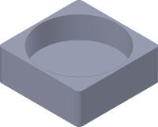 | [insert-hole](stl/insert/insert-hole.STL) | Store up to 5 pen |
|  | [insert-marker](stl/insert/insert-marker.STL) | Store up to 2 marker |
| 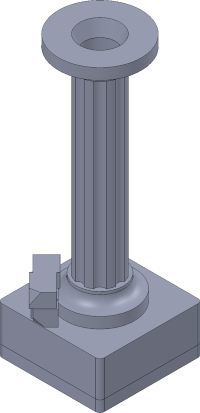 | [insert-pedestal](stl/insert/insert-pedestal/) | This insert consist in multiple 3d printed parts. Inside the base, a reed switch, a 5 mm LED, and a CR2032 coin cell are wired together. The LED illuminate the object placed on the platform, it acts like a beacon. See exploded view: [here exploded view](#exploded-view). |

### Exploded view

**insert-pedestal** link to folder: [insert-pedestal](stl/insert/insert-pedestal/)

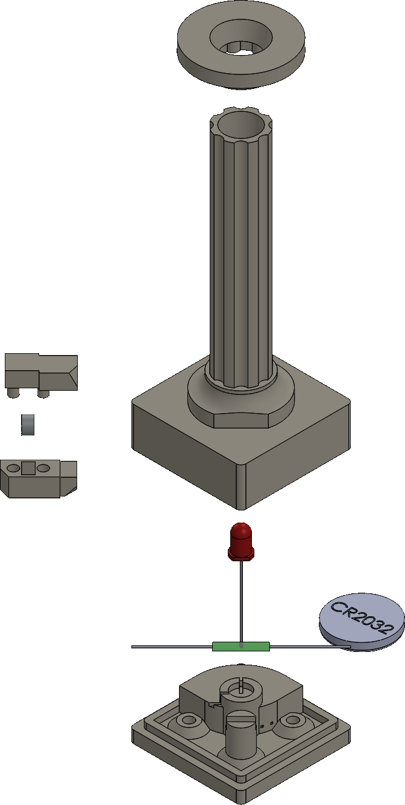

## Todo

- Add design reference drawing
- Create a model generator
- Add baseplates
