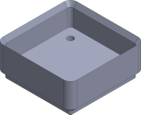
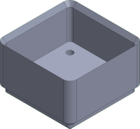
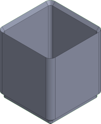
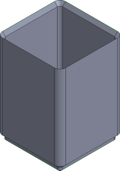
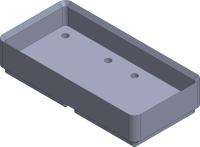
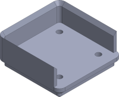

# insertfinity

An enhanced system compatible with the Zack Freedman's Gridfinity system (<https://gridfinity.xyz/>).

Gridfinity enhanced bin + custom insert = insertfinity

## Table of contents

- [insertfinity](#insertfinity)
  - [Table of contents](#table-of-contents)
  - [STL list](#stl-list)
    - [Bin with stacking lip](#bin-with-stacking-lip)
    - [Openbin with stacking lip](#openbin-with-stacking-lip)
    - [Insert for bin](#insert-for-bin)

## STL list

### Bin with stacking lip

| Image | Link | Description | Dimension [mm] |
|-------|------|-------------|----------------|
|  | [1x1x2u](stl/bin-stacking-lip/1x1x2u+lip.STL) | Bin 1x1x2u with stacking lip | 41.5x41.5x18.6 |
|  | [1x1x3u](stl/bin-stacking-lip/1x1x3u+lip.STL) | Bin 1x1x3u with stacking lip | 41.5x41.5x25.6 |
|  | [1x1x4u](stl/bin-stacking-lip/1x1x4u+lip.STL) | Bin 1x1x4u with stacking lip | 41.5x41.5x32.6 |
|  | [1x1x6u](stl/bin-stacking-lip/1x1x6u+lip.STL) | Bin 1x1x6u with stacking lip | 41.5x41.5x46.6 |
|  | [1x1x8u](stl/bin-stacking-lip/1x1x8u+lip.STL) | Bin 1x1x8u with stacking lip | 41.5x41.5x60.6 |
|  | [1x2x2u](stl/bin-stacking-lip/1x2x2u+lip.STL) | Bin 1x2x2u with stacking lip | 41.5x41.5x18.6 |

### Openbin with stacking lip

| Image | Link | Description | Dimension [mm] |
|-------|------|-------------|----------------|
|  | [1x1xo2u](stl/openbin-stacking-lip/1x1xo2u+lip.STL) | Openbin 1x2x2u with stacking lip | 41.5x41.5x18.6 |

### Insert for bin

| Image | Link | Description |
|-------|------|-------------|
|  | [insert-aaa-battery](stl/insert/insert-aaa-battery.STL) | Insert store up to 9 AAA battery |
|  | [insert-aa-battery](stl/insert/insert-aa-battery.STL) | Insert store up to 5 AA battery |
|  | [insert-18650-battery](stl/insert/insert-18650-battery.STL) | Insert store up to 2 18650 battery |
|  | [insert-usb-a](stl/insert/insert-usb-a.STL) | Insert store up to 6 usb type A|
|  | [insert-tool-6mm](stl/insert/insert-tool-6mm.STL) | Insert store up to 12 tool ⌀6mm |
|  | [insert-er16-collet](stl/insert/insert-er16-collet.STL) | Insert store up to 2 er16 collet |
